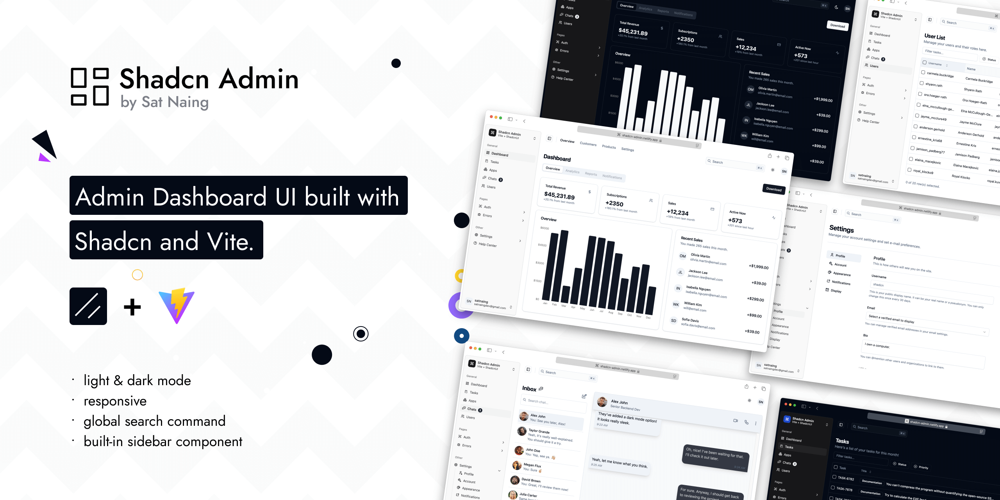

# Sale Smart AI - Frontend

Modern admin dashboard for Sale Smart AI e-commerce platform with AI-powered features. Built with responsiveness, accessibility, and user experience in mind.



A comprehensive web interface for managing products, analyzing reviews, tracking trust scores, and leveraging AI for intelligent business insights.

## Key Features

- ✨ **Light/Dark Mode** - Seamless theme switching
- 📱 **Responsive Design** - Works on all devices
- ♿ **Accessible** - WCAG compliant components
- 🎯 **Sidebar Navigation** - Organized menu structure
- 🔍 **Global Search** - Quick access command palette
- 📊 **10+ Dashboard Pages** - Comprehensive analytics and management
- 🛠️ **Custom Components** - Enhanced UI components with RTL support
- 🌍 **RTL Support** - Right-to-left language support

## Project Structure

```
src/
├── components/          # Reusable UI components
│   ├── ui/             # Shadcn UI components (customized for RTL)
│   └── ...             # Custom feature components
├── pages/              # Application pages
├── hooks/              # Custom React hooks
├── lib/                # Utility functions and helpers
├── styles/             # Global styles and themes
├── App.tsx             # Main application component
└── main.tsx            # Application entry point
```

## Available Scripts

| Command               | Description              |
| --------------------- | ------------------------ |
| `pnpm run dev`        | Start development server |
| `pnpm run build`      | Build for production     |
| `pnpm run preview`    | Preview production build |
| `pnpm run lint`       | Run ESLint               |
| `pnpm run type-check` | Check TypeScript types   |

## Component Customization Notes

Some Shadcn UI components have been customized for better RTL support and additional improvements:

**Modified Components:**

- scroll-area
- sonner
- separator

**RTL Updated Components:**

- alert-dialog, calendar, command, dialog, dropdown-menu, select, table, sheet, sidebar, switch

When updating components via Shadcn CLI, ensure you preserve these customizations. Standard components can be safely updated.

## Tech Stack

**UI:** [ShadcnUI](https://ui.shadcn.com) (TailwindCSS + RadixUI)

**Build Tool:** [Vite](https://vitejs.dev/)

**Routing:** [TanStack Router](https://tanstack.com/router/latest)

**Type Checking:** [TypeScript](https://www.typescriptlang.org/)

**Linting/Formatting:** [Eslint](https://eslint.org/) & [Prettier](https://prettier.io/)

**Icons:** [Lucide Icons](https://lucide.dev/icons/), [Tabler Icons](https://tabler.io/icons) (Brand icons only)

**Auth (partial):** [Clerk](https://go.clerk.com/GttUAaK)

## Quick Start

### Prerequisites

- Node.js 18+
- pnpm (recommended) or npm

### Installation

1. **Install dependencies:**

```bash
pnpm install
```

2. **Start development server:**

```bash
pnpm run dev
```

3. **Open browser:**

```
http://localhost:5173
```

### Build for Production

```bash
pnpm run build
```

### Preview Production Build

```bash
pnpm run preview
```

## Backend Integration

This frontend connects to the Sale Smart AI backend API running on `http://localhost:8000`. Ensure the backend is running before starting the frontend development server.

For backend setup instructions, see [BE README](../BE/README.md)

## Browser Support

- Chrome (latest)
- Firefox (latest)
- Safari (latest)
- Edge (latest)

## License

MIT License - See LICENSE file for details
